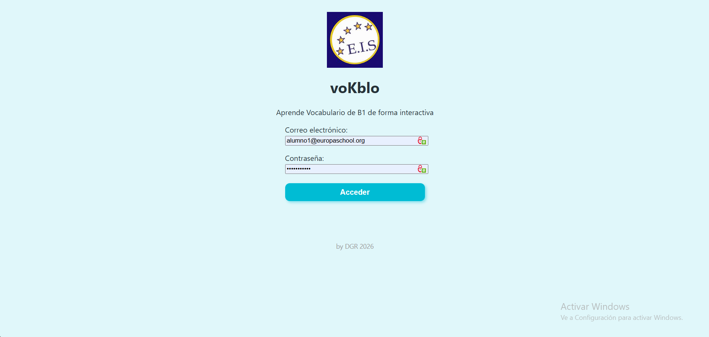
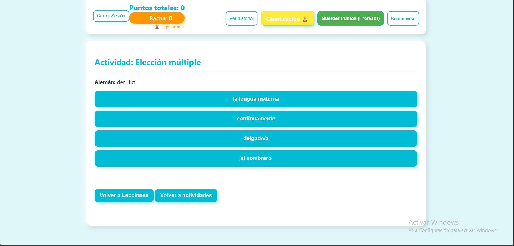
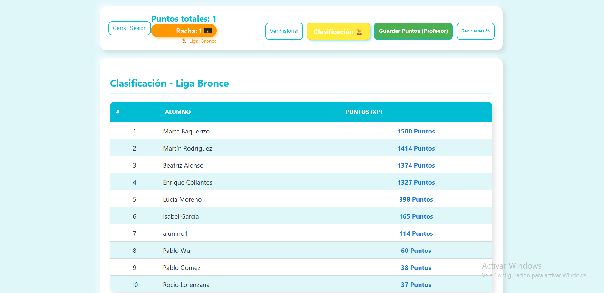
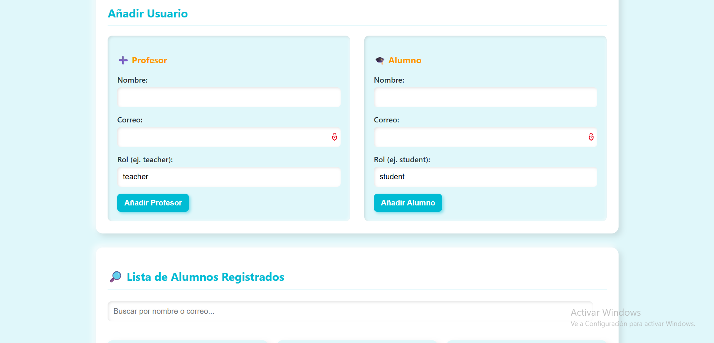

# voKblo -PLATAFORMA DE vOCABULARIO INTERACTIVA (B1 German)

[]

## 🔗 Enlaces del Proyecto
* **Demo en vivo:** [Github - voKblo Frontend](https://ulisesxxxi31.github.io/vokbloB1/)
* **Repositorio del Backend (API):** [GitHub - voKblo_backend](https://github.com/UlisesXXXI31/voKblo_backend)

### 🚀 Acceso Rápido (Demo)
Para facilitar la revisión del proyecto sin necesidad de crear una cuenta nueva, puedes utilizar las siguientes credenciales de prueba:


### Credenciales Frontend:
* **Usuario:** `alumno1@europaschool.org`
* **Contraseña:** `password123`

### Credenciales Backend:
* **Usuario:** `prof.prueba@europaschool.org`
* **Contraseña:** `password123`


## 📸 Capturas de Pantalla
Aquí puedes ver cómo luce **voKblo** en funcionamiento:

| Acceso y Seguridad | Menú de Lecciones |
| :---: | :---: |
|  |  |

| Menú Principal | Juego de Elección Múltiple |
| :---: | :---: |
|  |  |

| Ranking Global | Panel de Profesor |
| :---: | :---: |
|  |  |


**voKblo** es una aplicación web interactiva diseñada por un profesor de alemán para optimizar la adquisición de vocabulario de nivel B1. La plataforma combina principios pedagógicos de aprendizaje basado en el contexto con mecánicas de gamificación para fomentar el hábito de estudio diario.

---

## 🌟 El "Por qué" de este Proyecto
Como docente de alemán, identifiqué que la mayor barrera para el estudiante de nivel intermedio es la retención de léxico fuera de contexto. **voKblo** soluciona esto mediante:
*   **Aprendizaje Contextual:** Cada palabra se presenta integrada en frases reales.
*   **Gamificación Estratégica:** Sistema de puntos (XP), rachas (streaks) y clasificación global (Leaderboard).
*   **Accesibilidad Total:** Soporte offline (PWA) para estudiar en cualquier momento y lugar.

---

## 🛠️ Stack Tecnológico

### Frontend (Arquitectura Modular)
*   **Vanilla JavaScript (ES6+):** Código desacoplado en módulos especializados (`core`, `games`, `ui`) para garantizar la escalabilidad y mantenibilidad.
*   **HTML5 & CSS3:** Diseño responsivo con estética **Neumórfica** para una experiencia de usuario moderna y fluida.
*   **PWA & Service Workers:** Implementación de persistencia de datos y soporte offline.

### Backend & DevOps
*   **Node.js & Express:** API REST personalizada para la gestión de usuarios y progreso del aprendizaje.
*   **MongoDB Atlas:** Base de datos NoSQL para el almacenamiento de puntuaciones y perfiles.
*   **Vercel & GitHub Pages:** CI/CD para despliegue automático de la API y el cliente.

---

## 📊 Funcionalidades Destacadas

### 1. Sistema de Gamificación
*   **Rachas Dinámicas:** Algoritmo que premia la constancia y gestiona el decaimiento de la racha por inactividad.
*   **Clasificación en Tiempo Real:** Ranking global sincronizado mediante peticiones asíncronas (Fetch API) a un backend centralizado.

### 2. Panel de Control del Profesor
*   **Gestión de Alumnos:** Herramienta interna para que los docentes puedan monitorizar el progreso detallado, lecciones completadas y puntos obtenidos por cada estudiante.

### 3. Variedad de Actividades Interactivas
*   Módulos de **Flashcards**, **Traducción Directa**, **Emparejamiento de conceptos**, **Comprensión Auditiva** y **Pruebas de Pronunciación** (usando Web Speech API).

---

## 📁 Estructura del Repositorio
El código sigue una estructura de directorios limpia y profesional:

```text
├── assets/             # Recursos multimedia (iconos, sonidos, imágenes)
├── pages/              # Páginas secundarias (Login, Panel Profesor, Offline)
├── src/
│   ├── css/            # Estilos centralizados
│   └── js/
│       ├── core/       # Lógica central: API, Estado Global, Racha, Config
│       ├── games/      # Lógica independiente para cada modalidad de juego
│       └── app.js      # Punto de entrada y controlador de navegación
├── index.html          # Vista principal del alumno
└── service-worker.js   # Gestión de cache y modo offline
```

---

## 👨‍💻 Sobre el Autor
DANIEL GOMEZ RODRIGUEZ 
*Profesor de Alemán & Desarrollador de aplicaciones enfocadas en EdTech.*  
Mi misión es construir puentes entre la tecnología y la educación, creando herramientas digitales que no solo funcionen técnicamente, sino que resuelvan problemas reales en el aula.

---

### Cómo ejecutar este proyecto localmente
1. Clona el repositorio: `git clone https://github.com/UlisesXXXI31/vokblob1.git`
2. Abre el archivo `index.html` usando un servidor local (ej. Live Server en VS Code).
3. Asegúrate de tener conexión a internet para la sincronización inicial con la API de Vercel.
